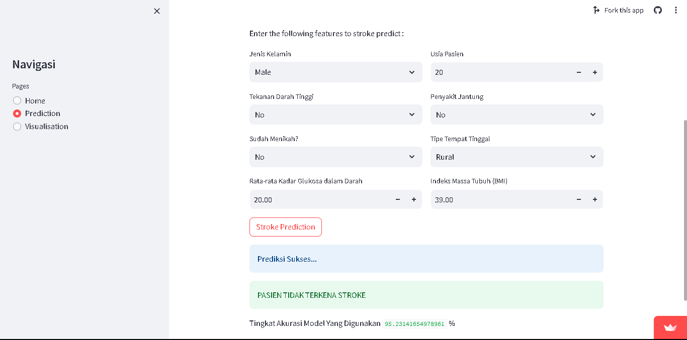

# Laporan Proyek Machine Learning
### Nama : Delvia Dianita Trianasari
### Nim : 211351039
### Kelas : Pagi A

## Prediksi Penyakit Stroke Menggunakan Algoritma K-Nearest Neighbor(KNN) 
### Latar Belakang

Stroke adalah salah satu penyebab kematian dan kecacatan terbesar di dunia. Menurut Organisasi Kesehatan Dunia (WHO), stroke menyebabkan kematian sekitar 6,7 juta orang setiap tahun. Di Indonesia, stroke merupakan penyebab kematian tertinggi ketiga, setelah penyakit jantung dan kanker.

Stroke terjadi ketika aliran darah ke otak terhambat atau terputus. Hal ini dapat disebabkan oleh penyumbatan pembuluh darah otak atau pecahnya pembuluh darah otak. Stroke dapat menyebabkan kerusakan otak yang permanen, yang dapat mengakibatkan kelumpuhan, gangguan bicara, dan gangguan kognitif.

Stroke dapat dicegah dengan menerapkan gaya hidup sehat, seperti mengonsumsi makanan yang sehat, berolahraga secara teratur, dan tidak merokok. Namun, tidak semua stroke dapat dicegah. Oleh karena itu, penting untuk dapat mendeteksi stroke secara dini agar dapat segera mendapatkan penanganan yang tepat.
Pembuatan aplikasi Stroke Prediction bertujuan untuk membantu mendeteksi stroke secara dini. 

Aplikasi ini akan menggunakan data medis pasien, seperti tekanan darah, kolesterol, gula darah, dan gaya hidup, untuk memprediksi risiko stroke.
Aplikasi Stroke Prediction dapat bermanfaat untuk meningkatkan kesadaran masyarakat tentang stroke dan membantu mendeteksi stroke secara dini. Aplikasi ini juga dapat membantu dokter dalam memberikan diagnosis dan pengobatan yang tepat.Berikut adalah beberapa manfaat yang dapat diperoleh dari aplikasi Stroke Prediction:
- Meningkatkan kesadaran masyarakat tentang stroke.
- Membantu mendeteksi stroke secara dini.
- Membantu dokter dalam memberikan diagnosis dan pengobatan yang tepat.
- Mengurangi angka kematian dan kecacatan akibat stroke.

## Business Understanding

### Problem Statements
Berdasarkan latar belakang yang telah dijelaskan sebelumnya, dapat diidentifikasi beberapa pernyataan masalah yang relevan dengan proyek pembuatan aplikasi Stroke Prediction, yaitu:
Bagian laporan ini mencakup:

- Stroke adalah salah satu penyebab kematian dan kecacatan terbesar di dunia. Penting untuk dapat mendeteksi stroke secara dini agar dapat segera mendapatkan penanganan yang tepat.
- Stroke dapat dicegah dengan menerapkan gaya hidup sehat, tetapi tidak semua stroke dapat dicegah.
- Aplikasi Stroke Prediction dapat bermanfaat untuk meningkatkan kesadaran masyarakat tentang stroke dan membantu mendeteksi stroke secara dini.

### Goals
Berdasarkan pernyataan masalah yang telah diidentifikasi, dapat dirumuskan beberapa tujuan dari proyek pembuatan aplikasi Stroke Prediction, yaitu:
- Mengembangkan aplikasi yang dapat membantu mendeteksi stroke secara dini.
- Meningkatkan kesadaran masyarakat tentang stroke.
- Membantu dokter dalam memberikan diagnosis dan pengobatan yang tepat.
 
## Solution statements
  - Menggunakan Algoritma KNN untuk memprediksi risiko stroke berdasarkan data medis pasien,seperti tekanan darah tinggi,kolestrol,gula darah,dan gaya hidup.
  Manfaat :
    1. Algoritma KNN adalah algoritma klasifikasi yang sederhana dan mudah diimplementasikan.
    2. Algoritma KNN dapat bekerja dengan baik pada data yang tidak terdistribusi normal.
    3. Algoritma KNN dapat digunakan untuk memprediksi risiko stroke berdasarkan data medis pasien.
  Metode Pengukuran:
    1. Akurasi: Akurasi adalah ukuran seberapa sering model memprediksi dengan benar.
    2. Sensitivitas: Sensitivitas adalah ukuran seberapa sering model memprediksi dengan benar bahwa seseorang akan terkena stroke.
    3. Spesifisitas: Spesifisitas adalah ukuran seberapa sering model memprediksi dengan benar bahwa seseorang tidak akan terkena stroke.
  

## Data Understanding
Untuk membuat aplikasi stroke prediction,saya menggunakan dataset "Stroke Prediction Dataset" dataset ini berisi tentang pasien dan riwayat stroke mereka. Data ini berjumlah 12 Atribut tetapi disini saya hanya menggunakan 8 atribut diantaranya:"gender,age,hypertension,heart_disease,ever_married_residence_type,avg_glucose_level,bmi".<br>
[stroke-prediction-dataset](https://www.kaggle.com/datasets/fedesoriano/stroke-prediction-dataset)  

### Variabel-variabel pada Stroke Prediction Dataset adalah sebagai berikut:
| No | Nama Variable    | Type Data |                                  Keterangan                               |
|----|------------------|-----------|---------------------------------------------------------------------------|
| 1  | id               | int64     |  Nomor identifikasi unik untuk setiap entitas atau individu dalam dataset.|
| 2  | gender           | object    | Jenis kelamin atau identitas gender seseorang ("Male" or  "Female").      |
| 3  | age              | float64   | Merupakan usia Pasien, umumnya diukur dalam tahun.                         |
| 4  | hypertension     | int64     | Menunjukan apakah Pasien memiliki tekanan darah tinggi(Memiliki Hipertensi (1)  atau Tidak Memiliki Hipertensi (0)).|
| 5  | heart_disease    | int64     | Menunjukan apakah Pasien memiliki penyakit jantung (Memiliki Penyakit Jantung(1) atau Tidak Memiliki Penyakit Jantung ).|
| 6  | ever_married     | object    | Menunjukan Apakah pasien Sudah Menikan ("Yes" or "No").|
| 7  | work_type        | object    |  Merupakan Jenis pekerjaan pasien (children", "Govt_jov","Never_worked", "Private" or "Self-employed").|
| 8  | residence_type   | object    | Merupakan tipe tempat tinggal pasien ("Rural" or "Urban")|
| 9  | avg_glucose_level| float     |Merupakan tingkat rata-rata glukosa dalam darah pasien.                     |
| 10 | bmi              | float64   | Merupakan indeks masa tubuh pasien.           |
| 11 | smoking_status   | object    |  Menunjukan status merokok pasien ("formerly smoked", "neve smoked", "smokes" or "Unknown").           |
| 12 | stroke           | int 64    |Variable target yang menunjukkan apakah pasien terkena stroke (1) atau tidak (0).    |


**Visualisasi Data**:<br>
Berikut adalah beberapa hasil Visualisasi Exploratory Data Analysis :<br>
<br>
Jenis plot yang digunakan adalah 'catplot' yang dihasilkan adalah diagram batang yang menampilkan jumlah orang dalam dataset yang memiliki stroke atau tidak, dikelompokkan berdasarkan status merokok mereka.<hr>

<br>
Plot ini akan menunjukkan bagaimana kejadian stroke terkait dengan jenis kelamin dan apakah adanya penyakit jantung memiliki pengaruh pada hubungan antara jenis kelamin dan stroke.<hr>

<br>
Plot ini akan menunjukkan bagaimana hubungan antara gender, stroke, dan kondisi hipertensi. Garis-garis pada plot bar akan membedakan antara nilai-nilai yang berbeda dalam kolom "hypertension" untuk setiap kategori "gender", dan tinggi dari setiap bar akan menunjukkan nilai dari kolom "stroke".<hr>

<br>
Plot ini akan menghasilkan histogram yang menunjukkan sebaran usia dari kedua kelompok tersebut. Setiap kelompok akan memiliki distribusi frekuensi usia mereka sendiri, yang dapat membantu dalam melihat pola atau perbedaan distribusi usia antara kedua kondisi (stroke dan tidak stroke).<hr>

<br>
Plot ini akan menghasilkan sebuah grafik histogram yang menunjukkan distribusi BMI pada dua kelompok yang berbeda: satu kelompok dengan pasien yang tidak mengalami stroke (No Stroke) dan kelompok lainnya dengan pasien yang mengalami stroke (Stroke).<hr>

<br>
Pair plot yang menunjukkan hubungan antara 'Usia', 'Gula Darah Rata-rata', 'Indeks Massa Tubuh', dan 'Stroke' dalam satu tampilan grafis yang memungkinkan untuk melihat pola atau korelasi antara variabel-variabel tersebut.<hr>


<br>
Heatmap yang menunjukkan korelasi antar atribut dalam DataFrame. Warna dari setiap kotak pada heatmap menunjukkan tingkat korelasi antara pasangan atribut yang bersangkutan, sedangkan angka-angka di dalam kotak tersebut menunjukkan nilai korelasinya. 


## Data Preparation
- **Mencari Dataset yang berisi informasi tentang pasien dan riwayat stroke mereka**<br>
  Kumpulan dataset yang berisi informasi terkait dengan Pasien dan riwayat stroke mereka. Disini saya menggunakan dataset dari kaggle yaitu [stroke-prediction-dataset](https://www.kaggle.com/datasets/fedesoriano/stroke-prediction-dataset)
- **Import Dataset Kaggle**<br>
  Dataset mengenai Prediksi Stroke diunduh dari Kaggle menggunakan API Kaggle seperti dibawah ini :
  ```python 
  from google.colab import files
  files.upload() 
  ```
  ```python 
  !mkdir -p ~/.kaggle
  !cp kaggle.json ~/.kaggle/
  !chmod 600 ~/.kaggle/kaggle.json
  ! ls ~/.kaggle
  ```
  ```python
  !mkdir stroke-prediction-dataset
  !unzip  stroke-prediction-dataset.zip -d stroke-prediction-dataset
  !ls stroke-prediction-dataset
  ```
- **Import Library yang dibutuhkan**<br>
  ```python
  import numpy as np
  import pandas as pd
  import seaborn as sns
  import matplotlib.pyplot as plt
  from sklearn.model_selection import train_test_split
  from sklearn.neighbors import KNeighborsClassifier
  from sklearn.preprocessing import StandardScaler
  from sklearn.preprocessing import LabelEncoder
  from sklearn.model_selection import train_test_split
  from sklearn.metrics import accuracy_score, confusion_matrix
  ```
- **Data Discovery**<br>
  - Membaca Data:<br>
    Dataset dibaca ke dalam DataFrame Pandas untuk analisis lebih lanjut
    ```python
    df = pd.read_csv("stroke-prediction-dataset/healthcare-dataset-stroke-data.csv")
    ```
  - Menghapus Kolom 'id' yang Tidak Diperlukan
    Menghilangkan kolom 'id' dari DataFrame karena tidak relevan untuk prediksi.<br>
  - Menghapus Nilai 'Unknown' dalam 'smoking_status'
    Baris dengan nilai 'Unknown' dalam kolom 'smoking_status' dihapus.
  - Menghapus Nilai 'Other' dalam 'gender'
    Baris dengan nilai 'Other' dalam kolom 'gender' dihapus.
  - Mengisi Nilai Kosong ('NaN') pada Kolom 'bmi'
    Mengisi nilai kosong dalam kolom 'bmi' dengan rata-rata dari kolom tersebut.
- **Exploratory Data Analysis**<br>
  Beberapa grafik dibuat menggunakan library Seaborn dan Matplotlib untuk memahami hubungan antara variabel dalam dataset seperti:
  - Distribusi variabel tertentu untuk kasus 'Stroke' vs 'No Stroke'.
  - Visualisasi hubungan antara beberapa variabel menggunakan pairplot.
  - Visualisasi hubungan antara beberapa variabel menggunakan pairplot.
- **Data Preparation**<br>
  - One-Hot Encoding <br>
     Mengubah kolom kategorikal menjadi bentuk biner.
     ```python
     df = pd.get_dummies(df,
                        columns=['work_type', 'smoking_status'],
                        prefix=['work', 'smoke'])
     ```
  - Mengubah Data Kategorikal<br>
    Mengubah beberapa kolom kategorikal menjadi representasi biner (0 dan 1).
  - Feature Scaling<br>
    Menskalakan fitur numerik menggunakan StandardScaler untuk memastikan semua fitur memiliki rentang nilai yang sama.
  - Pemilihan Fitur <br>
    Memilih fitur yang akan digunakan dalam proses pembelajaran mesin.
- **Modeling**
    - Pembagian Data Latih dan Uji<br>
      ```python
      X_train,X_test,y_train,y_test=train_test_split(X,y,test_size=0.3,random_state=42)
      ```
    - Pembuatan Model KNN<br>
      Menggunakan K-Nearest Neighbors (KNN) sebagai model machine learning untuk memprediksi kemungkinan stroke.
    - Evaluasi Model<br>
      Menghitung akurasi model dan membuat confusion matrix untuk melihat performa prediksi.
    - Menentukan Nilai Optimal K<br>
      Mencari nilai optimal k dalam model KNN dengan menganalisis error rate pada berbagai nilai k.
    - Prediksi<br>
      Melakukan prediksi menggunakan model KNN yang sudah di-train.
- **Visualisasi Hasil Modeling**<br
    Membuat visualisasi scatter plot untuk menunjukkan sebaran data dan lokasi prediksi.

## Modeling
Dalam tahap pemodelan dengan K-Nearest Neighbors (KNN) merupakan proses yang menggunakan algoritma ini untuk melakukan prediksi berdasarkan klasifikasi data berdekatan.
- **Pembagian Data Latih dan Data Uji**<br>
    train_test_split: Memisahkan dataset menjadi data latih (X_train, y_train) dan data uji (X_test, y_test).
     ```python
      X_train,X_test,y_train,y_test=train_test_split(X,y,test_size=0.3,random_state=42)
    ```
- **Pemodelan KNN**<br>
   Inisialisasi model KNN dengan 3 tetangga terdekat.
    ```python
    model=KNeighborsClassifier(n_neighbors=3)
    ```
    Melatih model KNN dengan data latih.
    ```python
    model.fit(X_train,y_train)
    ```
    Melakukan prediksi menggunakan data uji.
    ```python
    y_pred=model.predict(X_test)
    ```
    Menghitung akurasi model dengan data uji.
    ```python
    score = model.score(X_test, y_test)
    ```
    Mencetak Hasil Akurasi Model KNN
    ```python
    print('Akurasi Model K-Nearest Neighbor (KNN) =', score,"%")
    ```
    <br>
- **Pencarian Nilai Optimal K (Hyperparameter Tuning)**<br>
    Iterasi dilakukan untuk mencari nilai k terbaik dari 1 hingga 40,Untuk setiap nilai k, model KNN dilatih ulang dan dilakukan prediksi pada data uji. Menghitung error rate dan menyimpannya dalam list error_rate.
    ```python
    error_rate = []
    for i in range(1, 40):
    knn = KNeighborsClassifier(n_neighbors=i)
    knn.fit(X_train, y_train)
    pred_i = knn.predict(X_test)
    error_rate.append(np.mean(pred_i != y_test))
    ```
- **Plotting Error Rate terhadap Nilai K**<br>
    Grafik dibuat untuk menampilkan nilai error rate pada berbagai nilai k. Tujuannya adalah untuk menemukan nilai k terbaik yang memberikan error rate terendah.
    ```python
    plt.figure(figsize=(10, 6))
    plt.plot(range(1, 40), error_rate, color='grey', linestyle='dashed', marker='o',
            markerfacecolor='pink', markersize=10)
    plt.title('Error Rate vs. K Value')
    plt.xlabel('K Value')
    plt.ylabel('Error Rate')
    ```
    <br>
- **Pemilihan Nilai K terbaik**<br>
    Menentukan nilai k terbaik berdasarkan nilai error rate terendah yang ditemukan.
    ```python
    best_k = error_rate.index(min(error_rate)) + 1
    print(f"Best K: {best_k}")
    ```
     <br>
- **Evaluasi Model**<br>
    Membuat model KNN baru menggunakan nilai k terbaik yang telah ditentukan dan melakukan prediksi menggunakan data uji.
    ```python
    knn = KNeighborsClassifier(n_neighbors=best_k)
    knn.fit(X_train, y_train)
    y_pred = knn.predict(X_test)
    ```
    Membuat confusion matrix untuk mengevaluasi performa model dan mencetak Hasil Confusion Matrix
    ```python
    conf_matrix = confusion_matrix(y_test, y_pred)
    print("Confusion Matrix:")
    print(conf_matrix)
    ```
    <br>
- **Prediksi Menggunakan Model KNN**<br>
    Dilakukan prediksi terhadap data baru (input_data) dengan menggunakan model KNN yang telah dilatih sebelumnya.
    ```python
      input_data = np.array([[0,0.64,0,0,1,0,1.93,0.00]])

      prediction = knn.predict(input_data)
      prediction_label = 'No' if prediction == 0 else 'Yes'
      print('Prediction Stroke :', prediction)
    ```
     <br>
- **Visualisasi Modeling**<br>
    Plot Confusion Matrix<br>
    <br>

    Plot K-Neighboors<br>
    <br>

## Evaluation
Metrik evaluasi yang digunkan yaitu Akurasi dan Confusion Matrix.
- Akurasi
  Mengukur seberapa sering model melakukan prediksi yang benar secara keseluruhan dari semua kelas. Diukur dengan persentase prediksi yang benar dari total prediksi.
- Confusion Matrix
  Berupa tabel yang menunjukkan performa model pada klasifikasi, membandingkan nilai aktual dengan nilai yang diprediksi oleh model untuk setiap kelas. Terdiri dari empat bagian:
  - True Positive (TP): Prediksi yang benar untuk kelas positif.
  - True Negative (TN): Prediksi yang benar untuk kelas negatif.
  - False Positive (FP): Prediksi yang salah untuk kelas positif.
  - False Negative (FN): Prediksi yang salah untuk kelas negatif.

Analisis Berdasarkan Metrik Evaluasi
- Akurasi Model
  Akurasi model dapat memberikan informasi tentang seberapa baik model dapat memprediksi secara keseluruhan. Jika tinggi, menunjukkan model memiliki kemampuan yang baik dalam memprediksi kelas.
- Confusion Matrix
  Melalui confusion matrix, kita dapat mengevaluasi seberapa baik model dalam membedakan antara kelas positif dan negatif. Misalnya, apakah model memiliki kecenderungan untuk lebih sering salah mendiagnosis kasus stroke (False Positive) atau mengabaikan kasus stroke yang sebenarnya (False Negative).

## Deployment
[Stroke Prediction](https://strokeprediction-a6wbrwejuroetpyx6nfyve.streamlit.app/)

 <br>
 <br>
 <br>
 <br>


